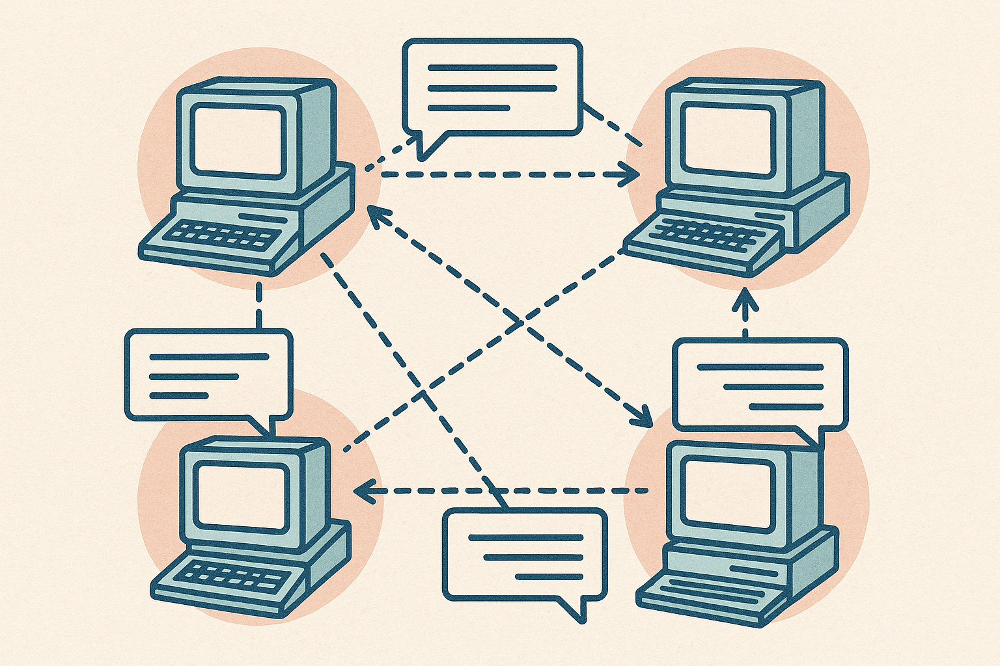
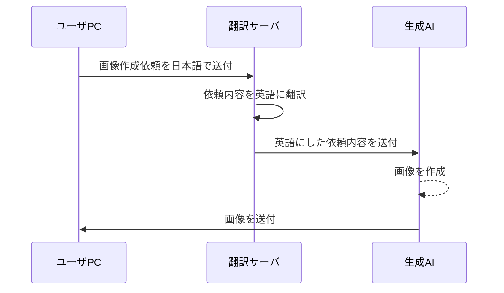
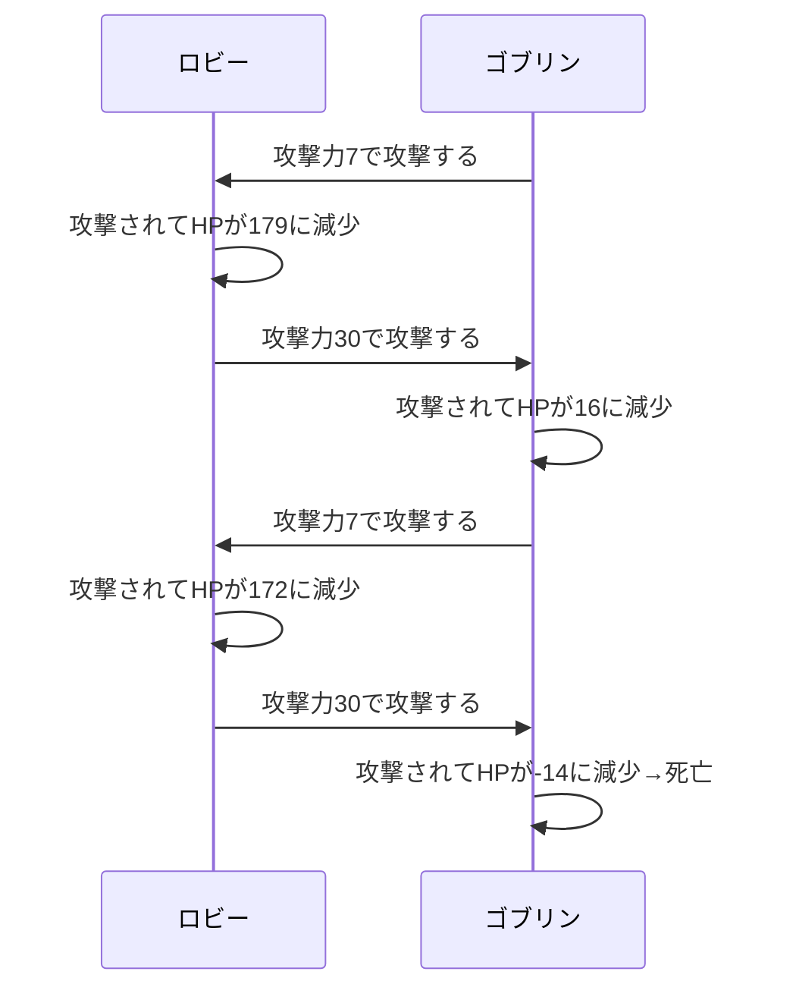

# memo

## オブジェクト指向プログラミングの概要イメージ

### 1.コンピュータ・ネットワークのたとえ



オブジェクト指向プログラミングは、上の絵のような、ネットワーク上のコンピュータたちに例えることができます。

具体的なやり取りを、下のシーケンス図を使って説明します。




**仕組みの特徴**

1. お互いの中身を知らない

    - 例えば、ユーザPCは翻訳サーバに質問を送る方法は知っているが、翻訳サーバの中の仕組みを知らないし、その仕組みの変更もできない
    - ほかのコンピュータ間の関係も同じ

1. 命令ではなく、メッセージ

    - 必要なパラメータをメッセージに含めて送れば、受けた相手が自発的に動いてくれる
    - 手続きすべてを指示する必要はない

1. ひとつひとつの役割は限定的

    - 「ユーザーPC」「翻訳サーバ」「AIシステム」は万能ではなく、それぞれの役割をこなすだけ
    - コンピュータ間のつながりでシステムが動く

### 2.ロールプレイング・ゲームのたとえ

**キャラクター**

```text
フィールド（プロパティ、メンバ変数）
    名前:ロビー
    職業:戦士
    レベル:31
    最大HP:250
    現在のHP:186
    攻撃力:30 (ロングソード装備)
    防御力:12 (チェインメール装備)

メソッド
〇攻撃する(攻撃する相手, 自分の攻撃力)
    攻撃する相手に「攻撃する」ことと「自分の攻撃力」をメッセージとして送る
〇攻撃される(敵の打撃力)
    現在のHP <- 現在のHP - (敵の打撃力 - 防具の防御力)
〇回復する(回復するHP)
    現在のHP <- 現在のHP + 回復するHP
〇休む
    現在のHP <- 最大HP
```

**モンスター**

```text
フィールド（プロパティ、メンバ変数）
    名前:ゴブリン
    最大HP:50
    現在のHP:46
    攻撃力:7
    防御力:2

メソッド
〇攻撃する(攻撃する相手, 自分の攻撃力)
    攻撃する相手に「攻撃する」ことと「自分の攻撃力」をメッセージとして送る
〇攻撃される(敵の打撃力)
    現在のHP <- 現在のHP - (敵の打撃力 - 防具の防御力)
〇回復する(回復するHP)
    現在のHP <- 現在のHP + 回復するHP
```

これらを使った戦闘の様子を見てみましょう。



**攻撃する相手に「攻撃する」ことと「自分の攻撃力」をメッセージとして送る**

ことは、すなわち

**相手の「攻撃される」メソッドを、「自分の攻撃力を引数」にしてよびだすこと**

と同じです。

>必要なパラメータをメッセージに含めて送れば、受けた相手が自発的に動いてくれる

と書いたのは、そのことを表しています。

## クラスとインスタンス

オブジェクト指向プログラミングの **オブジェクト** とは、上の例えで言えば個々のコンピュータやキャラクター（モンスターを含む）を指す、抽象的な概念です。

それらをより具体的にした **クラス** と **インスタンス** について、「設計図（仕様書）」と「実物（スマホやパソコン）」に例えて説明します。

---

### 1. クラスとは「設計図」

クラス（Class）は、オブジェクトの「設計図」や「ひな形（テンプレート）」のことです。

- **役割：** これから作るオブジェクトが「どんなデータ（プロパティ、メンバ変数）」を持ち、「どんな動き（関数、メソッド）」をするのかという **共通のルールを文章で定義したもの** です。
- **特徴：** あくまで「紙に書かれた設計図」なので、クラスそのものにデータを保存して動かすことはできません。

---

### 2. インスタンスとは「設計図から作られた実物」

インスタンス（Instance）は、クラスという設計図をもとに、コンピュータのメモリ上に「実際に組み立てられた実物」のことです。

- **役割：** 設計図を具現化したものなので、ここで初めて「中にデータを入れ、メッセージを受け取って動く」ことができるようになります。
- **特徴：** **1つの設計図（クラス）から、何個でも別々の実物（インスタンス）を作ることができます。**

---

### 3. 具体例：スマートフォンで考える

みなにとって最も身近な「スマホ」を例にしてみましょう。

- **スマートフォン クラス（設計図）：**
- **データ（属性）：** 電話番号、所有者名、バッテリー残量
- **メソッド（振る舞い）：** 電話をかける()、アプリを開く()


- **インスタンス（実物）：**
- **インスタンスA：** 所有者「山田くん」、電話番号「090-xxxx」、バッテリー「80%」の実物スマホ。
- **インスタンスB：** 所有者「佐藤さん」、電話番号「080-xxxx」、バッテリー「100%」の実物スマホ。


> **💡 例えば…**
> 山田くんのスマホの画面が割れても（インスタンスAのデータを書き換えても）、佐藤さんのスマホ（インスタンスB）には何の影響もありませんよね。なぜなら、設計図は同じでも **「メモリ上の別々の場所に作られた、全く別の実物」** だからです。

---

### 4. プログラムの世界での言葉の整理

基本情報技術者試験や、C++・Java・JavaScriptなどのコードを見るときは、以下のように脳内変換するよう伝えてあげてください。

| 用語 | 意味（例え） | プログラムでの正体 |
| --- | --- | --- |
| **クラス** | 設計図 | `class`キーワードで書かれたコード（型） |
| **インスタンス** | 組み立てられた実物 | `new` という命令で作られたメモリ上のデータ（オブジェクト） |

「クラスは紙の上のデザイン、インスタンスは電気を通して動いている本物のミニコンピュータ」

この区別ができるようになると、この後に続く応用概念も、「あ、設計図の段階でそういうルールを決めておくんだな」と、迷子にならずに理解できるようになりますよ。

## 「.(ドット)」を使った属性や振る舞いへのアクセス

疑似言語やオブジェクト指向のプログラミングで登場する **`.`（ドット）** は、日本語の「の」という意味を持つ記号です。

オブジェクトという「独立したミニコンピュータ」の中にあるデータ（属性）や命令（メソッド）をピンポイントで指定するときに使います。

---

### 1. 属性（データ）へのアクセス ＝ 「〜の〜」

オブジェクトが持っている情報（変数）を取り出したり、書き換えたりするときに使います。

- **疑似言語の書き方：** `スマホ．所有者`
- **意味：** スマホ **「の」** 所有者
- **日常の例え：** 「山田くん **の** 電話番号」「佐藤さん **の** 体重」

```text
山田スマホ.電話番号 ← "090-xxxx"
（山田スマホ「の」電話番号という箱に、データを代入する）

```

---

### 2. メソッド（動き）へのアクセス ＝ 「〜の〜を動かす」

オブジェクトに「この仕事をやって！」とメッセージ（依頼）を送るときに使います。

- **疑似言語の書き方：** `スマホ．電話をかける()`
- **意味：** スマホ **「の」** 電話をかける機能（メソッド）を実行する
- **日常の例え：** 「ロボット **の** 前に進む()」「犬 **の** ほえる()」

```text
佐藤スマホ.アプリを開く("LINE")
（佐藤スマホ「の」アプリを開く機能を、"LINE"という情報付きで呼び出す）

```

---

### まとめ：ドットは「中身を覗くための鍵」

学生さんには、「オブジェクト名の後ろに『．』を打つことで、その箱の中身（データや機能）にアクセスできるんだよ」と教えてあげてください。

* `オブジェクト名．属性` ＝ 「〇〇 **の** データ」
* `オブジェクト名．メソッド()` ＝ 「〇〇 **の** 動き（関数）」

これだけ覚えておけば、疑似言語の長いプログラムに出てくるドット表記も、普通の日本語と同じようにスラスラ読めるようになります！

## コンストラクタ

疑似言語における「コンストラクタ（初期化メソッド）」は、オブジェクト指向のプログラムでインスタンス（実物）が誕生する瞬間に、裏側で大活躍する特殊な仕組みです。

ポイントは三つ

1. クラス名と同じ名前を持つメソッド
1. インスタンスを生成するときに呼び出され、主にインスタンスを使用するための初期設定を行う
1. 生成されたインスタンスへの参照（メモリ上のアドレス）を戻り値とする

---

### 1. クラス名と同じ名前を持つメソッド

コンストラクタは、他のメソッド（動き）とは違って、「自分が定義されているクラスの名前と100%同じ名前」にする習慣があります。疑似言語の仕様として明文化されてはいませんが、ほぼこの基準に従います。

>Pythonでは別の名前で定義しますが、呼び出すときは`クラス名()`を使用します

**なぜ同じ名前にするのか？**

コンピュータに「これは普通の仕事（メソッド）じゃなくて、**このクラスの実物を作るための特別な命令だよ**」とひと目で分からせるためです。

```text
/* クラスの定義 */
class スマホ
    /* 下がコンストラクタの定義！ クラス名「スマホ」と完全に一致させている */
    public スマホ(整数型: initialBattery)
        // 初期設定の処理
    endmethod
endclass
```

---

### 2. インスタンス生成時に呼び出され、初期設定を行う

- **日常の例え：工場の「初期設定（アクティベーション）」**

スマートフォンを工場で組み立てた直後は、まだ電源が入っていなかったり、持ち主の名前が登録されていなかったりします。初めにコンストラクタという「初期設定プログラム」が動くことで、バッテリー残量を設定したり、持ち主の名前を箱に書き込んだりして、「いつでも使える状態」にしてくれるのです。

```text
山田スマホ ← スマホ(100)  // バッテリー100%で初期化
```

---

### 3. 生成されたインスタンスへの参照（メモリ上のアドレス）を戻り値とする

ここが試験やアルゴリズムで最も見落としやすい、技術的に重要なポイントです。

コンストラクタのプログラムの中には、どこにも `return`（戻り値を返す命令）とは書かれていません。しかし、コンストラクタは仕事を終えると、裏側で自動的に「新しく作った実物が、メモリのどこに置かれたかという住所（参照・アドレス）」を返してくれます。

- **日常の例え：不動産屋の契約書**

「家を新しく建てる」という命令を出すと、家が完成した後に「その家が建っている場所の住所（何区何番地）」が書かれた書類（参照）が手元に返ってきますよね。

- **プログラムでの動き：**

`山田スマホ ← スマホ(100)` という式では、コンストラクタが返してくれた「メモリ上の住所」を、左側の `山田スマホ` という変数（箱）に代入しています。これ以降、プログラムは「あの住所にあるスマホを操作してね」と迷わずにアクセスできるようになります。

---

### まとめ

コンストラクタは、『実物が生まれた瞬間に、命（初期値）を吹き込み、その実物がどこにいるかの居場所（住所）を教えてくれる、誕生祝いの儀式』のようなものです。
