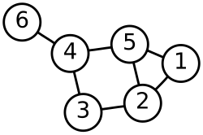
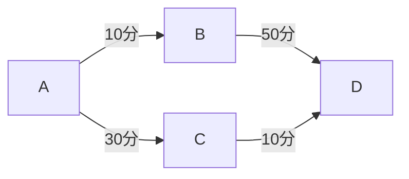
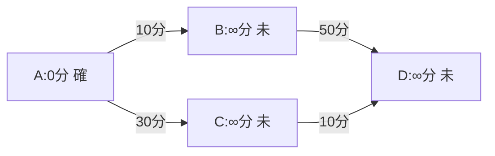
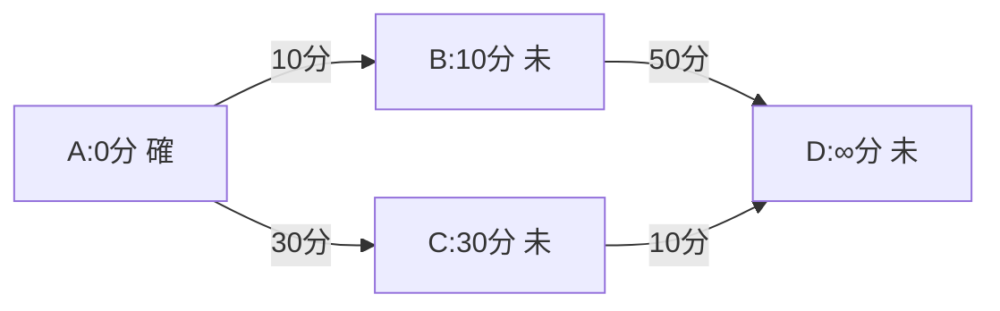
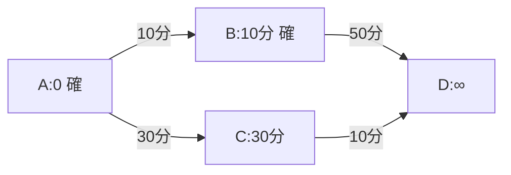
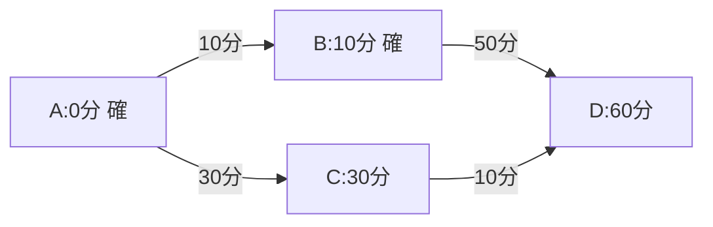
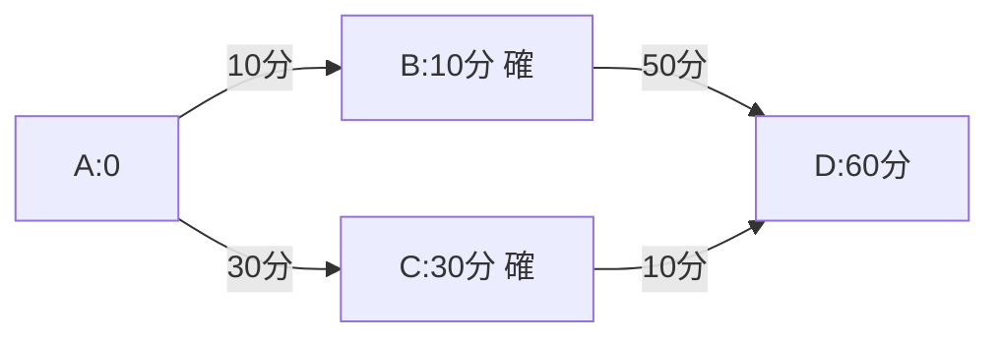
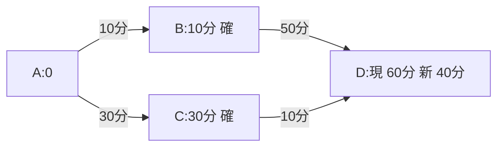
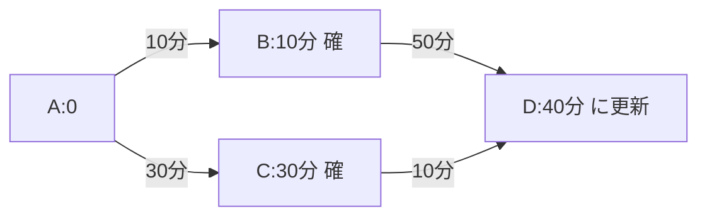
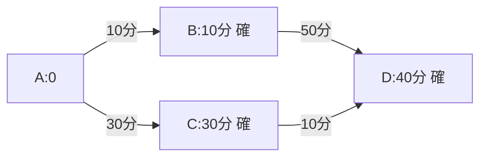

# グラフを用いた最短経路探索

ツリー構造が「上から下への階層」だったのに対し、**「グラフ（Graph）」** はノード同士がより自由に、網の目のようにつながったデータ構造です。



道路網、SNSの友人関係、インターネットの配線など、現実世界の複雑なつながりを表現するのに欠かせない概念です。

---

## 1. グラフの構成要素

グラフは、以下の2つの要素で成り立っています。

* **頂点（Vertex / Node）：** データそのもの（駅、ユーザー、Webページなど）。
* **辺（Edge）：** 頂点同士を結ぶ線（路線、フォロー関係、リンクなど）。

### グラフの種類

1. **無向グラフ：** 辺に方向がない（「AとBは友人」という相互関係）。
2. **有向グラフ：** 辺に矢印がある（「AがBをフォローしている」という一方通行）。
3. **重み付きグラフ：** 辺に数値（コスト）がある（「駅Aから駅Bまで10分かかる」という距離や時間）。

---

## 2. グラフの表現方法（コンピュータ内での持ち方）

コンピュータは図をそのまま理解できないため、以下のいずれかの形式でデータを保持します。

* **隣接行列：** 二次元配列を使い、つながっていれば「1」、なければ「0」を入れる表形式。
* **隣接リスト：** 各頂点がつながっている相手のリストを持つ形式（メモリ効率が良い）。

例として、以下の簡単な4つの頂点（A, B, C, D）を持つグラフ（ネットワーク）を考えます。

```text
  [A] ─── [B]
   │       │
   │       │
  [C] ─── [D]

```

* Aは「B、C」とつながっている
* Bは「A、D」とつながっている
* Cは「A、D」とつながっている
* Dは「B、C」とつながっている

---

### ① 隣接行列：二次元配列を使った「総当たり表」

隣接行列は、縦軸と横軸にすべての頂点を並べた「2次元配列（クラスマッチの総当たり表のようなもの）」でつながりを表す方式です。

* **ルール：** つながっていれば **`1`**、つながっていていなければ **`0`** を入れます。

上のグラフを隣接行列（表）にすると、以下のようになります。

|  | A | B | C | D |
| --- | --- | --- | --- | --- |
| **A** | 0 | 1 | 1 | 0 |
| **B** | 1 | 0 | 0 | 1 |
| **C** | 1 | 0 | 0 | 1 |
| **D** | 0 | 1 | 1 | 0 |

#### 💡 隣接行列の特徴

* **メリット（超高速確認）：** 「AとDはつながっている？」と調べたいとき、配列の `[A][D]` の部屋（0行3列目など）をピンポイントで見に行くだけで、一瞬で「0（つながっていない）」だと分かります。
* **デメリット（メモリの無駄遣い）：** もし、頂点が10,000個もある巨大なSNSのつながり（友達関係）をこの表で作ると、$10,000 \times 10,000 = 1$ 億個の部屋が必要になります。実際にはそんなに全員と友達なわけではないので、**表のほとんどが「0」で埋め尽くされ、メモリの巨大な無駄遣い**になってしまいます。

---

### ② 隣接リスト：つながっている相手だけの「アドレス帳」

隣接リストは、すべての頂点に対して、**「自分と直接つながっている相手だけ」を1次元配列や連結リストで箇条書きにしたもの**です。

* **ルール：** 自分のお隣さんの名前だけをメモする。

上のグラフを、単方向連結リストのデータ構造を使って、隣接リストにすると、以下のようになります。

```text
[A] のお隣さん ──> [ B ] ──> [ C ]
[B] のお隣さん ──> [ A ] ──> [ D ]
[C] のお隣さん ──> [ A ] ──> [ D ]
[D] のお隣さん ──> [ B ] ──> [ C ]

```

#### 💡 隣接リストの特徴

* **メリット（抜群のメモリ効率）：** つながっていない相手（0のデータ）は最初から記録しません。**「本当につながっている線の数」の分しかメモリを使わない**ため、頂点がいくら増えてもメモリを節約できます。
* **デメリット（確認に時間がかかる）：** 「AとDはつながっている？」と調べたいとき、Aのメモ（B, C）を先頭から1つずつめくって「Dはあるかな？」と探さなければいけません。相手が多いと、確認に少し時間がかかります。

---

## 3. 代表的なグラフアルゴリズム

グラフを扱う上で最も有名な、試験や実務で頻出のアルゴリズムを紹介します。

### ① 最短経路問題（ダイクストラ法）

特定の地点から別の地点まで、**「最もコスト（時間・距離）が少なく済むルート」** を見つけるアルゴリズムです。カーナビやGoogleマップの経路検索の基本です。

### ② 最小全域木（Prim法 / Kruskal法）

すべての頂点を「最小のコスト」で、かつ「閉路（ループ）」を作らずにつなぐ道筋を見つけるアルゴリズムです。電気の配線や光ファイバー網を最も安く敷設する設計などに使われます。

### ③ トポロジカルソート

有向グラフにおいて、「Aが終わらないとBに進めない」といった依存関係を矛盾なく一列に並べる方法です。プログラムのビルド順序や、大学の履修科目の前提条件の整理に使われます。

---

## 4. グラフの探索手法

前回の「木の巡回」と同じ考え方が使えます。

* **幅優先探索 (BFS)：** 近い頂点から順に調べる。最短経路（ステップ数）を求めるのに適しています。
* **深さ優先探索 (DFS)：** 行けるところまで奥へ進む。迷路の脱出路を見つけたり、ネットワークにループがあるかチェックするのに適しています。

---

## 5. 実社会での活用

* **SNSのエコーチェンバー分析：** 似た意見を持つグループがどうつながっているか。
* **物流の最適化：** 荷物を効率よく配送するルートの計算。
* **レコメンドエンジン：** 「この商品を買った人はこちらも」という相関グラフの構築。

---

## 6. ダイクストラ法で最短経路を求める具体的な手順

最も実用的な **「ダイクストラ法で最短経路を求める具体的な手順」** を詳しく見てみます。

グラフアルゴリズムの中で最も有名で、かつ実用的なのが **ダイクストラ法（Dijkstra's Algorithm）** です。

一言でいうと、**「スタート地点から、他のすべての地点（または特定のゴール）までの最短距離を求める」** ためのアルゴリズムです。Google マップのルート検索の裏側でも、この考え方が応用されています。

---

### ① ダイクストラ法の基本ルール

このアルゴリズムは、**「重み付きグラフ（辺にコストがあるグラフ）」** に対して使われます。ただし、一つだけ重要な制約があります。

> **制約：** すべての辺のコストが「0以上」であること。（マイナスのコストがあると正しく動かないため、別のアルゴリズムが必要になります）

---

### ② アルゴリズムの仕組み（直感的なイメージ）

「自分に近いところから順に、最短距離を確定させていく」というステップを繰り返します。

#### ステップ：

1. **初期化：**
* スタート地点の距離を「0」、それ以外を「無限大（）」にする。


2. **探索：**
* まだ「確定」していない地点の中で、**最も距離が短い地点** を選び、そこを「確定」とする。


3. **更新（緩和）：**
* 確定した地点から行ける隣の地点の距離を計算し、今の値より短くなるなら書き換える。


4. **繰り返し：**
* すべての地点が「確定」するまで、2と3を繰り返す。

---

### ③ 具体的な例で考える

A駅からD駅までの最短時間を求めるとします。



1. **スタート A(0)** を確定



2. Aから行けるのは B(10分) と C(30分)。


3. 未確定の中で一番近い **B(10分)** を確定！



4. Bから行けるDまでの時間を計算。A→B(10分) + B→D(50分) = **計60分**。



5. 次に近いのは **C(30分)**。Cを確定！



6. Cから行けるDまでの時間を計算。A→C(30分) + C→D(10分) = **計40分**。



7. もともとのDの候補（60分）より短いので、**Dは40分に更新！**




8. 最後に **D(40分)** を確定して終了。



※ 上の図を見ると、各駅を下のようなメンバ変数を持ったオブジェクトとして操作していることがわかります。

```text
class Station
    文字列型: 名前 // A～Dの名前
    整数型: 所要時間 // 基点からの所要時間
    論理型: 確定 // フラグ,確定していれば 1, 未確定なら0
endclass

```

---

### ④ 特徴

* **確実性：** 「その時点で一番近いところ」を順に確定していくため、一度確定した距離が後からもっと短くなることはありません（これが「負のコスト」がない前提で成り立つ理由です）。

---

### ⑤ 実社会での応用例

* **カーナビ・地図アプリ：** 最短時間・最短距離のルート探索。
* **ネットワークのルーティング：** インターネット上でパケットをどの経路で送るかの決定（OSPFプロトコルなど）。
* **ゲームAI：** 敵キャラクターがプレイヤーにたどり着くための最短ルート計算。

---

