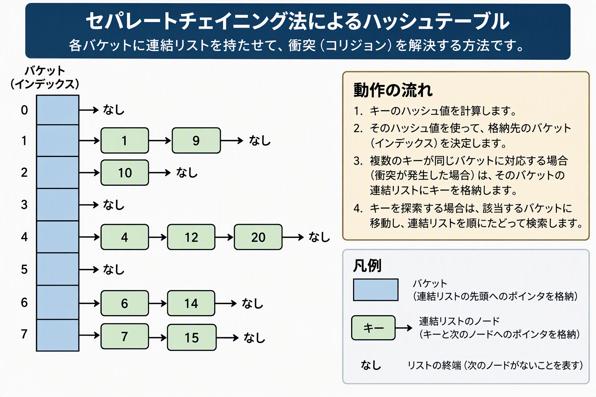

# ハッシュ法・シノニム・チェイン法

ハッシュ法と、データが重なったときの解決策である「チェイン法」について、プログラミング初心者の方にもイメージしやすいよう解説します。

---

## 1. ハッシュ法とは？（爆速でデータを探す仕組み）

通常のデータ検索（配列を先頭から1つずつ調べるなど）では、データが増えるほど探す時間がかかってしまいます。

そこで登場するのが「ハッシュ法」です。

ハッシュ法を一言でいうと、「データの置き場所（部屋番号）を計算式で直接割り出し、一発でデータを取り出す技術」です。

### 身近なイメージ：学校の「出席番号」と「ロッカー」

学校で「Tanakaくんの荷物はどこ？」と探すとき、ロッカーを1つずつ開けて探すのは大変ですよね。

もし「出席番号がそのままロッカーの番号」になっていれば、番号を見るだけで一発で目的のロッカーにたどり着けます。ハッシュ法はこの仕組みをプログラムで実現したものです。

---

## 2. 割り出しに使う「ハッシュ関数」

データの置き場所を決めるための計算ルールのことを「ハッシュ関数」と呼びます。

例えば、**部屋が0番〜4番の5つ**あるシステムがあるとします。

* **ルール（ハッシュ関数）：** 「入力された数値を **5 で割った余り** を部屋番号（ハッシュ値）とする」

このルールに従うと：

* **`12`** を入れる $\rightarrow 12 \div 5 = 2$ あまり **`2`** $\rightarrow$ **2番の部屋へ**
* **`25`** を入れる $\rightarrow 25 \div 5 = 5$ あまり **`0`** $\rightarrow$ **0番の部屋へ**

探すときも同じ計算をするだけで、「`12` は2番の部屋にある！」と一瞬で分かります。

---

## 3. シノニムの発生（衝突）とは？

ここで問題が発生します。

次に **`17`** というデータを入れようとしたとします。

* **`17`** を入れる $\rightarrow 17 \div 5 = 3$ あまり **`2`** $\rightarrow$ **2番の部屋へ**

しかし、2番の部屋にはすでに **`12`** が入っています。

このように、「違うデータなのに、計算結果（ハッシュ値）が同じになってしまい、置き場所が重なってしまう現象」**を**シノニム発生（またはハッシュ衝突 / コリジョン）と呼びます。

---

## 4. 解決策：チェイン法（Chaining）

シノニムが発生したときに「どうやって両方のデータを保持するか？」という解決策の代表格が「チェイン法（オープンハッシュ法）」です。

チェイン法の考え方はとてもシンプルです。

「部屋の中にデータを直接置くのではなく、データを『数珠つなぎ（リスト）』にしてぶら下げる」という方法です。

[Image illustrating separate chaining hash table with linked lists attached to each bucket to handle collisions]

### チェイン法のデータの保持イメージ

* **0番の部屋:** `[25]`
* **1番の部屋:** `空`
* **2番の部屋:** `[12]` $\rightarrow$ `[17]`（数珠つなぎで連結！）
* **3番の部屋:** `空`
* **4番の部屋:** `空`

データが衝突したら、元々あったデータの「後ろ」に矢印（ポインタ）で繋いでどんどんぶら下げていきます。まるで鎖（チェイン）のように繋がっていくため、チェイン法と呼ばれます。



### 探すときの動き

例えば **`17`** を探す場合：

1. $17 \div 5$ のあまりを計算し、**2番の部屋**を見に行く。
2. 部屋の先頭にある `12` を確認する $\rightarrow$ 「探している `17` ではない」。
3. 繋がっている次のデータ `17` を確認する $\rightarrow$ **「見つかった！」**

衝突が起きても、チェインを辿るだけで目当てのデータにたどり着くことができます。

---

## 5. まとめ

| 用語 | 意味 |
| --- | --- |
| **ハッシュ法** | 計算式を使ってデータの置き場所を一発で特定する高速な検索手法。 |
| **ハッシュ関数** | データを置き場所（数値）に変換する計算ルールのこと。 |
| **シノニム発生（衝突）** | 異なるデータから同じ置き場所が割り出されてしまう現象。 |
| **チェイン法** | 衝突したデータを「リスト（鎖）」のように繋げて保存する解決策。 |

---

## 6. 疑似言語プログラム（新形式完全準拠）

基本情報技術者試験（科目B）の新形式仕様に沿った、**チェイン法（Chaining）によるハッシュテーブルの実装サンプル**です。

ここでは単方向リスト（ポインタ構造）を用いて、データ追加（`insert`）とデータ検索（`search`）を行うアルゴリズムを記述しています。

```text
/* 単方向リストのノード定義 */
型: Node
  整数型: key
  Node: next  /* 次のノードへの参照（存在しない場合は null） */

/* ハッシュテーブルの大きさ（例として 5 とします） */
定数: 整数型: BUCKET_SIZE ← 5

/* ハッシュテーブル本体（各要素はリストの先頭ノードを指す配列） */
Node: hashTable[BUCKET_SIZE]  /* 全要素を null で初期化 */


/* ハッシュ関数：余りを計算する */
○整数型: hash(整数型: key)
  return key % BUCKET_SIZE


/* データを挿入する関数 */
○関数: insert(整数型: key)
  整数型: index ← hash(key)
  
  /* 新しいノードを作成 */
  Node: newNode ← 新しいNode
  newNode.key ← key
  newNode.next ← null

  /* 対象のバケットが空の場合 */
  if (hashTable[index] == null)
    hashTable[index] ← newNode
  else
    /* すでにデータが存在する場合（シノニム発生）：リストの先頭に追加 */
    newNode.next ← hashTable[index]
    hashTable[index] ← newNode
  endif


/* データを検索する関数（見つかれば true、無ければ false） */
○論理型: search(整数型: key)
  整数型: index ← hash(key)
  Node: current ← hashTable[index]  /* 該当する部屋の先頭ノードを取得 */

  /* リストを辿って探す */
  while (current ≠ null)
    if (current.key == key)
      return true  /* 見つかった */
    endif
    current ← current.next  /* 次のノードへ進む */
  endwhile

  return false  /* 最後まで見つからなかった */

```

---

## 3. アルゴリズムのポイント

### ① 挿入処理（`insert`）における「先頭追加」

シノニム（衝突）が発生した際、上記コードではリストの「先頭」に新しいノードを追加しています。

* `newNode.next ← hashTable[index]`
* `hashTable[index] ← newNode`

末尾まで辿って追加するよりも、先頭に挿入する方が処理が **$O(1)$**（定数時間）で済むため、実装効率・処理速度ともに優れています。

### ② 検索処理（`search`）における「リスト走査」

1. キーからハッシュ値を計算して `hashTable[index]` を直接見に行きます。
2. そのバケットから伸びているリストを `while (current ≠ null)` で順番にポインタ（`.next`）を辿って目的の `key` を探索します。

---

