# ユークリッドの互除法

アルゴリズムの世界で「最古かつ最も美しい」と言われるものの一つが、**ユークリッドの互除法（Euclidean Algorithm）** です。

これは、2つの整数の **「最大公約数（GCD: Greatest Common Divisor）」** を効率よく求める手法です。紀元前300年ごろの数学者ユークリッドによって記されましたが、現代でも暗号技術などで現役で使われています。

---

## 1. 基本的な考え方

「2つの数の最大公約数は、**小さい方の数**と、**大きい方の数を小さい方の数で割った余り**の最大公約数と同じである」という性質を利用します。

これを繰り返し、余りが「0」になったときの割る数が最大公約数です。

---

## 2. 具体的な手順

例として、「252」と「105」の最大公約数を求めてみましょう。

1. **252 ÷ 105** = 2 余り **42**
2. 次は「105」を「42」で割る：**105 ÷ 42** = 2 余り **21**
3. 次は「42」を「21」で割る：**42 ÷ 21** = 2 余り **0**
4. 余りが0になった！このときの割る数 **「21」** が最大公約数です。

割り算（余り）を使うことで一気に数字を小さくできるのがこのアルゴリズムの凄さです。

---


## 3. なぜこれで求まるのか？（長方形の敷き詰め）

図形的に考えると分かりやすくなります。

「縦252、横105の長方形を、同じ大きさの正方形で隙間なく埋めたい。その正方形の最大サイズは？」という問題と同じです。

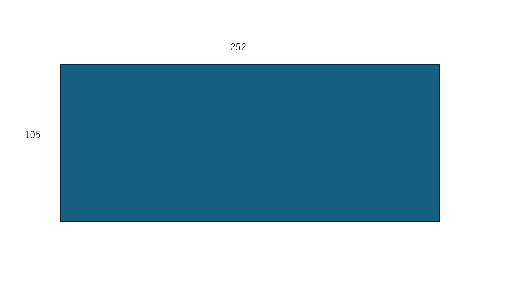

まず大きな正方形（105×105）で埋められるだけ埋め、

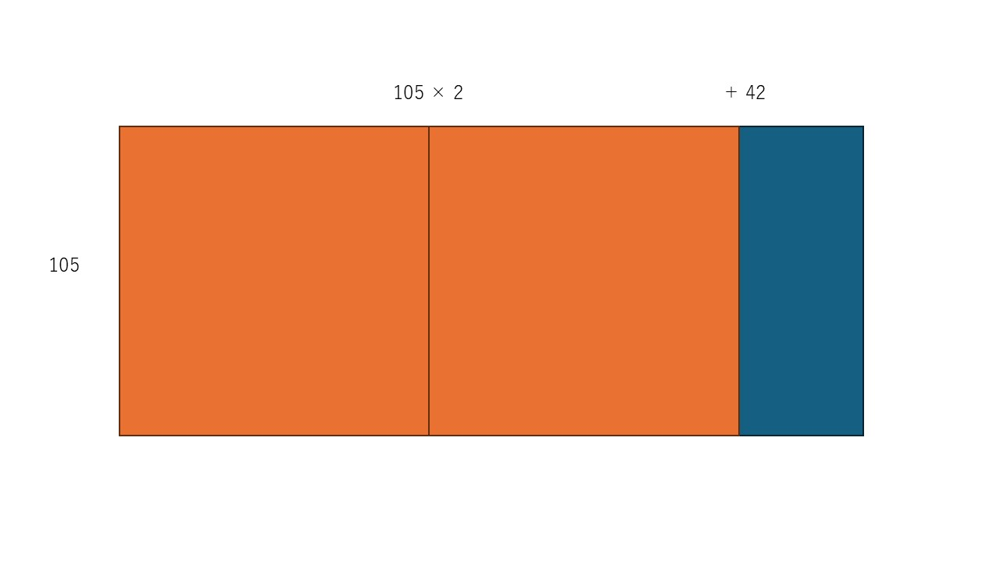

余った細長い部分（147×462）をまた正方形で埋める

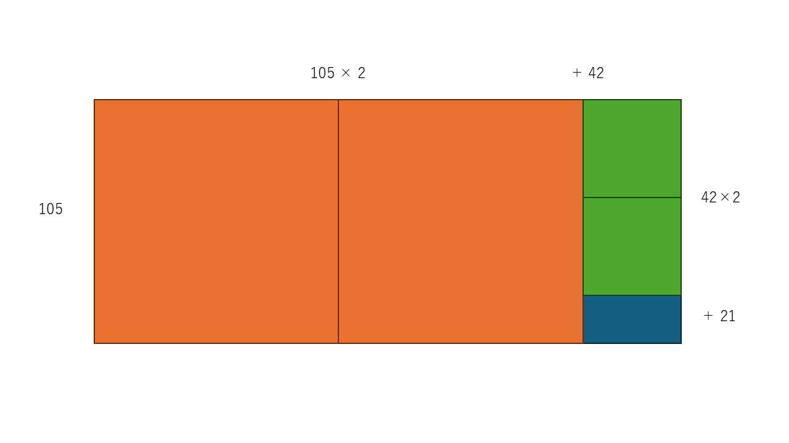

……という作業を繰り返す

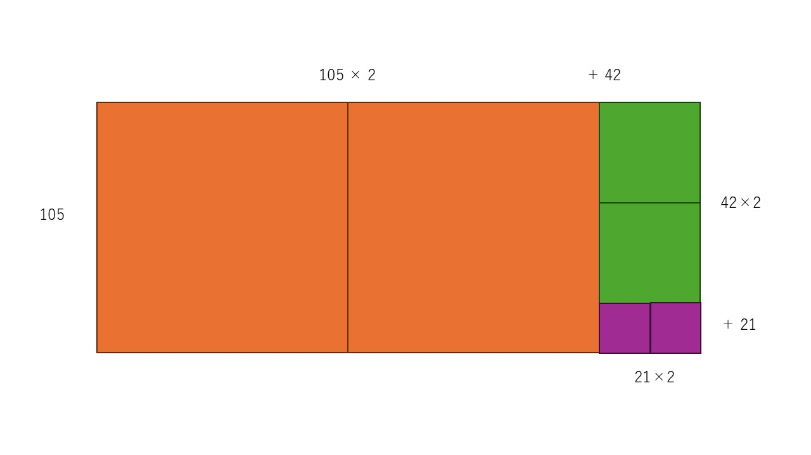

と、最後にぴったり埋まる正方形のサイズが導き出されます。

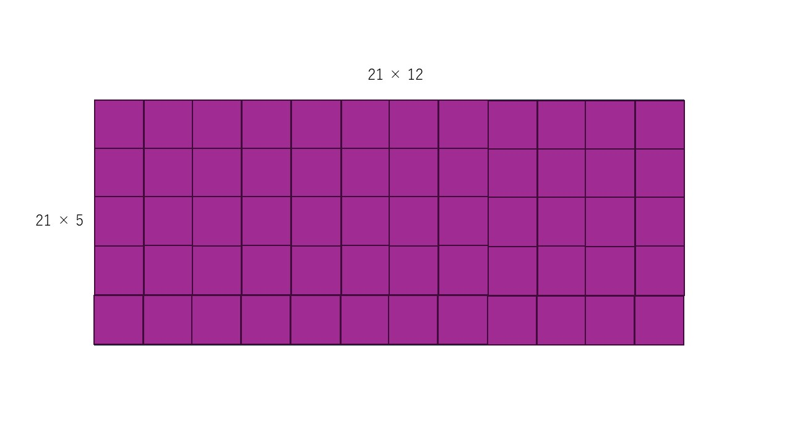

---

## 4. プログラムでの実装（再帰）

このアルゴリズムは「再帰」と非常に相性が良く、数行で書けてしまいます。

### 疑似言語の例

```text
/* ユークリッドの互除法（最大公約数を求める関数） */
〇 GCD(整数型: a, 整数型: b)
    if (b ＝ 0)
        return a
    endif
    
    return GCD(b, a ％ b)  /* 「a を b で割った余り」は演算子 ％ で表現 */

```

---

## 5. 基本情報技術者試験でのポイント

試験では、このアルゴリズムを **「引き算」** で実現するパターンも出題されます。
「余り」を求めることは、引き算を何度も繰り返すことと同じだからです。

* `A > B` なら `A = A - B`
* `B > A` なら `B = B - A`
* `A = B` になったら、それが最大公約数。

計算効率は割り算を使ったほうが圧倒的に高いですが、ロジックとしてはどちらも同じユークリッドの互除法です。

### 例（図解）

例として、「252」と「105」の最大公約数を求めてみましょう。

*以下の図の著作権者: Proteins - 投稿者自身による著作物, CC 表示-継承 3.0, https://commons.wikimedia.org/w/index.php?curid=6639790による*

1. **252 - 105** = **147**

---

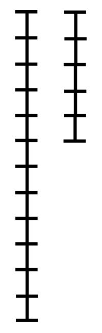

※ この段階では、まだ最大公約数が求まっていないため、実際にはまだそれぞれの棒が何目盛分であるかはわかっていないが、便宜上、５目盛と１２目盛で刻んでいる。

---

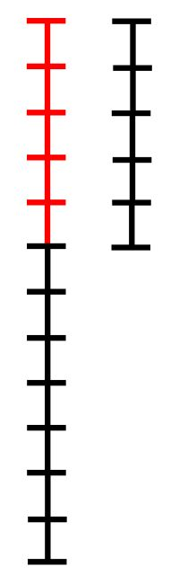

---

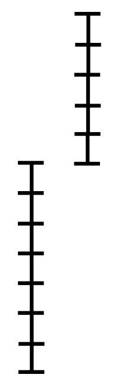

---

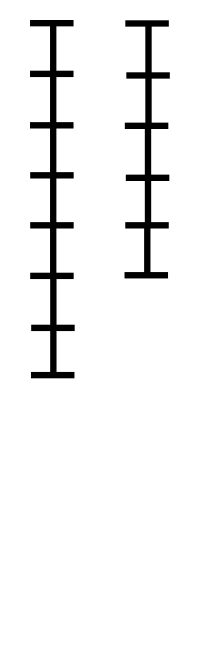


---

1. **147 - 105** = **42**


---

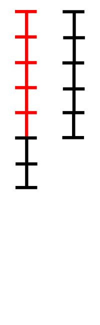

---

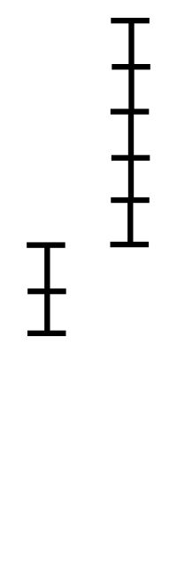

---

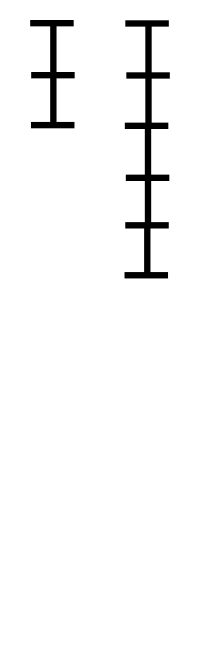


---

2. **105 - 42** = **63**

---

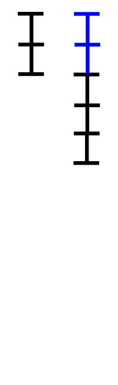

---

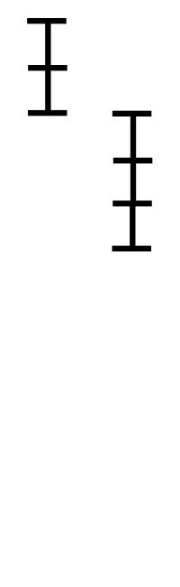

---

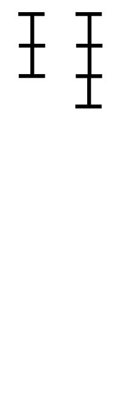

---

3. **63 - 42** = **21**

---

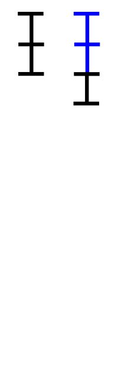

---

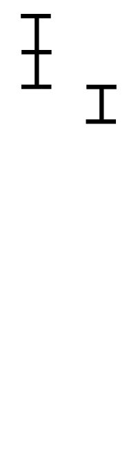

---

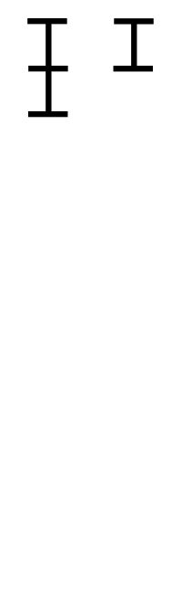


---

4. **42 - 21** = **21**

--

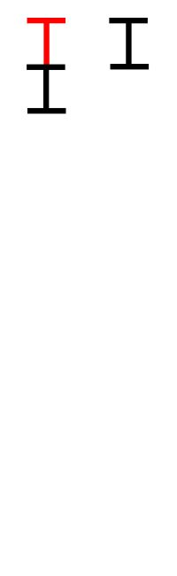

---

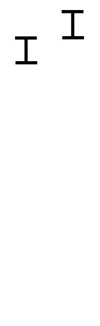

---

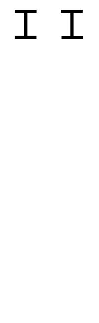

---

4. **21 - 21** = **0**

---


---


---

5. 余りが0になった！このときの数 **「21」** が最大公約数です。

---


