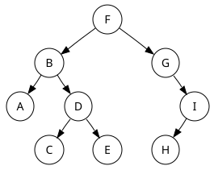
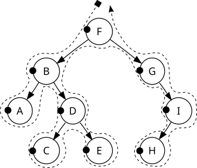
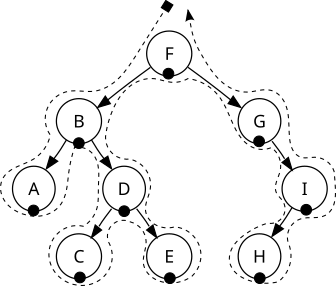
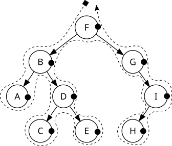
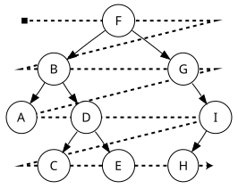

# 二分木の基礎


## 1. はじめに：なぜ二分木を学ぶのか

この章では、コンピュータサイエンスの分野で極めて重要なデータ構造である「二分木」について学びます。二分木は、効率的なデータの検索、ソート、階層構造の表現といった、私たちが日々直面する基本的な課題を解決するための強力なツールです。一見すると複雑に思えるかもしれませんが、その基本的な原理を理解することで、より高度なアルゴリズムやデータ構造への扉が開かれます。

この章を通じて、以下の主要な概念を習得します。

* 二分木の定義: 二分木とは何か、その基本的な構成要素と特性を学びます。
* 探索アルゴリズム: 木構造に格納されたデータにアクセスするための主要な手法である「深さ優先探索」と「幅優先探索」を理解します。
* C言語による実装: 概念的な知識を、C言語のコードを通して具体的な形にする方法を分析します。

それではまず、二分木を構成する基本的な要素と用語の理解から始めましょう。

## 2. 二分木の基本概念

このセクションでは、二分木を理解する上で不可欠な基本的な用語とその特性について解説します。これらの概念は、木構造に対する挿入、削除、探索といった、より高度な操作を学ぶ上での確固たる基盤となります。

以下に、主要な用語を解説します。

### 二分木 (Binary Tree)

各ノードが最大で2つの子（左の子と右の子）しか持たない木構造のデータ構造です。このシンプルな制約が、効率的なアルゴリズムの設計を可能にします。

```text
            g                  s                  9
           / \                / \                / \
          b   m              f   u              5   13
         / \                    / \                /  \
        c   d                  t   y              11  15
```

二分木は、二分探索木やバイナリヒープといった、より特殊化されたデータ構造を実装するための基礎となります。これらは、データの効率的な検索やソート処理に広く利用されています。

### 平衡木 (Balanced Tree)

木のすべてのノードにおいて、そのノードを根とする左の部分木と右の部分木の深さ（高さ）の差が1以下である木を指します。

```text
          平均木            平均木ではない
            g                  s        
           / \                / \       
          b   m              f   u      
         / \                    / \     
        c   d                  t   y    
                              /     \
                             x       r 
```

### 深さ/高さ (Depth/Height)

木の根（ルート）から特定のノードまたは葉（リーフ）までの距離を示す指標です。根の深さを0とし、階層が下がるごとに1ずつ増加します。木のノード数を n とした場合、平衡木の深さは log2(n) の整数部分で近似でき、これが探索効率に大きく関わってきます。

```text
                  深さ/高さ
                    ---
            g        0
           / \      ---
          b   m      1
         / \        ---
        c   d        2  
                    ---
```

**平衡木の重要性**

平衡木が特に重要視されるのは、その深さ（高さ）が予測可能になるためです。データが偏って挿入されると、木は線形リストのような不均衡な形状になり、探索効率が大幅に低下します。一方、平衡木は深さが log2(n) 程度に保たれるため、探索、挿入、削除といった操作の計算量を効率的に維持することができます。

基本的な概念を理解したところで、次はこれらの木構造に格納されたデータをどのように辿っていくか、すなわち探索アルゴリズムについて掘り下げていきましょう。

## 3. 木の探索（トラバーサル）アルゴリズム

木構造に格納されたデータにアクセスするためには、すべてのノードを体系的に訪問する手順が必要です。この手順を「探索（トラバーサル）」と呼びます。トラバーサルは、単にデータを見つけるだけでなく、特定の順序で処理を行うためにも不可欠な戦略です。

探索には主に2つの戦略があります。

|戦略名|説明|
|---|---|
|深さ優先探索 (DFS)|根から始まり、各分岐を可能な限り深く探索してから、次の分岐に移る（バックトラックする）アルゴリズム。|
|幅優先探索 (BFS)|あるレベル（階層）の全ノードを訪れてから、次のより低いレベルへ進むアルゴリズム（レベル順探索）。|

下の図のツリーを使って説明します。



### 深さ優先探索

特に深さ優先探索（DFS）は、実装の容易さから広く使われており、ノードを訪問するタイミングによって3つの主要な種類に分類されます。

#### 行きがけ順 (Pre-order)

ノードを最初に **訪問 (visit)** し、次に左の子、最後に右の子を辿ります。 (訪問 -> 左 -> 右)



#### 通りがけ順 (In-order)

最初に左の子を辿り、次にノードを **訪問 (visit)** し、最後に右の子を辿ります。 (左 -> 訪問 -> 右)



#### 帰りがけ順 (Post-order)

最初に左の子、次に右の子を辿り、最後にノードを **訪問 (visit)** します。 (左 -> 右 -> 訪問)



どの探索方法を選択するかによって、ノードが処理される順序は全く異なります。

### 幅優先探索

あるレベル（階層）の全ノードを訪れてから、次のより低いレベルへ進むアルゴリズム（レベル順探索）です。



それでは次のセクションで、これらのアルゴリズムがC言語でどのように実装されるのか、具体的なコードを見ていきましょう。

## 4. 疑似言語とC言語による実装の分析

ここからは、これまでに学んだ理論的な概念が、実際のC言語のコードでどのように表現され、機能するのかを分析します。コードを読み解くことで、抽象的なデータ構造が具体的なロジックに落ちていく過程を理解することができます。

### 4.1. ノードのデータ構造

疑似言語で、二分木を構成する基本単位である「ノード」を、オブジェクトとして表現してみます。各ノードは、自身の値、そして左と右の子ノードへの参照を保持します。

```text
// 二分探索木のノードを表す
// クラス名
Node

// メンバ変数
整数型: val
Node: left
Node: right

// コンストラクタ
〇Node(整数型: v)
    val ← v
    left ← null
    right ← null
```

C言語では構造体 (struct) を用いて表現するのが一般的です。二分木を構成する基本単位である「ノード」は、各ノードは、自身の値、そして左と右の子ノードへのポインタを保持します。

```c
typedef struct node {
    int val;
    struct node* left;
    struct node* right;
} node_t;
```

この node_t 構造体は、val という整数型の値を格納するメンバーと、自身と同じ node_t 型へのポインタである left と right を持ちます。これにより、各ノードが他の2つのノードを指し示す、連鎖的な構造が実現されます。

左右それぞれの子ノードがない状態は、`left == NULL`、 `right == NULL` で表現します。

また、`val == 0` はツリー自体が空(初期状態)であることを示すものとします。

### 4.2. 挿入ロジック (insert関数)

次に、二分探索木に新しいデータを追加する insert 関数のロジックを見てみましょう。この関数は、再帰を用いて適切な挿入位置を探します。

疑似言語

```text
/* 挿入を行う関数（再帰呼び出し） */
〇insert(Node: tree, 整数型: val)
    if (tree.val ＝ 0)
        /* 現在の位置が空（初期状態）なら値を設定 */
        tree.val ← val
    else
        if (val ＜ tree.val)
            /* 左側の枝へ挿入する処理 */
            if (tree.left ≠ null)
                insert(tree.left, val)
            else
                /* 左側が空なら、新しいノードを作成して接続 */
                tree.left ← new Node(val)
            endif
        else
            if (val ≧ tree.val)
                /* 右側の枝へ挿入する処理 */
                if (tree.right ≠ null)
                    insert(tree.right, val)
                else
                    /* 右側が空なら、新しいノードを作成して接続 */
                    tree.right ← new Node(val)
                endif
            endif
        endif
    endif
```

このアルゴリズムは、大小関係に基づいてノードを配置する順序木を生成します。ただし、挿入されるデータの順序によっては木が不均衡になる可能性があり、必ずしも平衡木になるわけではない点に注意してください。

この関数のロジックは以下のステップで実行されます。

1. まず、`tree.val = 0`かどうかをチェックします。これは、この演習における「ノードが空である」という特殊な状態を示しており、主に最初の値（根）を挿入するために使われます。
2. ノードが空でない場合、挿入したい値 val と現在のノードの値 tree.val を比較します。**val が小さければ左** へ、**val が大きければ右** へ進みます。
3. 進んだ先に子ノードがまだ存在しない場合（`tree.left = NULL` または `tree.right = NULL`）、それが挿入のベースケースとなります。ここで malloc を使って新しいノードのメモリを確保し、値を設定して木に連結します。
4. 進んだ先に子ノードが既に存在する場合、その子ノードを新たな起点として insert 関数自身を呼び出します。これが再帰ステップであり、適切な空き場所が見つかるまで木を深く辿っていきます。

次に、C言語実装です。

```c
void insert(node_t * tree, int val) {
    if (tree->val == 0) {
        /* 現在の位置が空（初期状態）なら値を設定 */
        tree->val = val;
    } else {
        if (val < tree->val) {
            /* 左側の枝へ挿入する処理 */
            if (tree->left != NULL) {
                insert(tree->left, val);
            } else {
                /* 左側が空なら、新しいノードを作成して接続 */
                tree->left = (node_t *) malloc(sizeof(node_t));
                tree->left->val = val;
                tree->left->left = NULL;
                tree->left->right = NULL;
            }
        } else {
            if (val >= tree->val) {
            /* 右側の枝へ挿入する処理 */
                if (tree->right != NULL) {
                    insert(tree->right,val);
                } else {
                /* 右側が空なら、新しいノードを作成して接続 */
                    tree->right = (node_t *) malloc(sizeof(node_t));
                    tree->right->val = val;
                    tree->right->left = NULL;
                    tree->right->right = NULL;
                }
            }
        }
    }
}
```

ここで、シニアエンジニアの視点から重要な注意点を共有します。このコードの tree->val == 0 というチェックは、あくまでこの演習のための簡略化された実装です。実際のアプリケーションでは、0 という値も木に挿入したい正当なデータかもしれません。このように特定の値に特別な意味を持たせる実装は堅牢性に欠けるため、通常はツリーやノード自体が NULL であるかどうかで空の状態を判断する方が良い設計です。

### 4.3. 探索の実装 (printDFS関数)

最後に、木の内容を出力するための深さ優先探索（DFS）の実装を見てみましょう。

```text
/* 深さ優先探索 */
〇printDFS(Node: current)
    if (currentが未定義)
        return
    if (current.leftが未定義でない)
        printDFS(current.left)
    if (currentが未定義でない)
        current.valを画面に出力
    if (current.rightが未定義でない)
        printDFS(current.right)
```

この関数の処理の順序を注意深く見てください。

1. 左の子に対して printDFS を再帰的に呼び出す (左)
2. 現在のノードの値 (current.val) を画面に出力する (訪問)
3. 右の子に対して printDFS を再帰的に呼び出す (右)

この 左 -> 訪問 -> 右 という順序は、前セクションで学んだ **通りがけ順 (In-order) 探索** に他なりません。この実装が順序木に対して適用されると、結果としてノードの値が昇順（小さい順）で出力されるという重要な特徴があります。これは、通りがけ順の非常に強力な応用例です。

C言語の実装

```c
/* depth-first search */
void printDFS(node_t * current) {
    if (current == NULL) return; /* security measure */
    if (current->left != NULL) printDFS(current->left);
    if (current != NULL) printf("%d ", current->val);
    if (current->right != NULL) printDFS(current->right);
}
```

これまでの分析を踏まえ、次のセクションではこの printDFS 関数を課題に従って変更する演習に取り組んでみましょう。

## 5. 演習：探索順序の変更

このセクションでは、これまでに学んだ知識を実践に移すための演習を行います。理論を理解するだけでなく、それを応用して実際のコードを仕様通りに変更するスキルは、エンジニアにとって非常に重要です。

### 課題:

 現在の printDFS 関数（通りがけ順）を、行きがけ順 (Pre-order) の深さ優先探索に変更してください。

**解答と解説**

行きがけ順（Pre-order）の定義は 訪問 -> 左 -> 右 でした。この順序を実現するには、関数の処理の順番を入れ替えるだけです。

変更後のコード 以下が、行きがけ順に修正した printDFS 関数です。

疑似言語

```text
/* 深さ優先探索 - 行きがけ順 */
void printDFS(node_t * current)
    if (currentが未定義) /* セキュリティ対策 */
        return;

    /* 現在のノードを最初に訪問(出力) */
    current.valを画面に出力

    /* その後、再帰的に左の部分木を訪問 */
    if (current.left が未定義でない)
        printDFS(current.left)
    endif

    /* 最終的に、再帰的に右の部分木を訪問 */
    if (current.right が未定義でない)
        printDFS(current.right)
    endif
```

C言語

```c
/* depth-first search - pre-order */
void printDFS(node_t * current) {
    if (current == NULL) return; /* security measure */

    /* Visit the current node first */
    printf("%d ", current->val);

    /* Then recur on left subtree */
    if (current->left != NULL) {
        printDFS(current->left);
    }

    /* Finally recur on right subtree */
    if (current->right != NULL) {
        printDFS(current->right);
    }
}
```

変更点の解説 変更点は、`printf("%d ", current->val);` の行を、左右の子への再帰呼び出しよりも前に移動させたことだけです。これにより、関数が呼び出された際に、まず現在のノードの値を「訪問（出力）」し、その後に左の部分木、右の部分木の順で探索を進めるという「行きがけ順」のロジックが実現されます。

このように、再帰的な処理の順序を少し変えるだけで、探索の振る舞いを大きく変えられることが、木構造のアルゴリズムの興味深い点です。

## 6. まとめ

本研修では、二分木の基本的な概念からC言語による具体的な実装、そして簡単なアルゴリズムの改修までを学びました。最後に、本研修の最も重要なポイントを振り返りましょう。

1. 二分木の構造 各ノードが最大2つの子を持つというシンプルなルールが、階層的なデータを効率的に管理するための強力な基盤となることを学びました。
2. 探索アルゴリズムの重要性 深さ優先探索（DFS）や幅優先探索（BFS）は、木構造に格納されたデータに体系的にアクセスするための不可欠なツールです。特にDFSにおける「行きがけ順」「通りがけ順」「帰りがけ順」は、目的応じてデータの処理順序を制御する上で重要です。
3. 理論から実践へ C言語の構造体と再帰関数を用いることで、二分木のような抽象的なデータ構造を具体的にコードとして実装できることを確認しました。理論的な知識を実際のコードに落とし込む能力は、エンジニアとしての成長に欠かせません。

