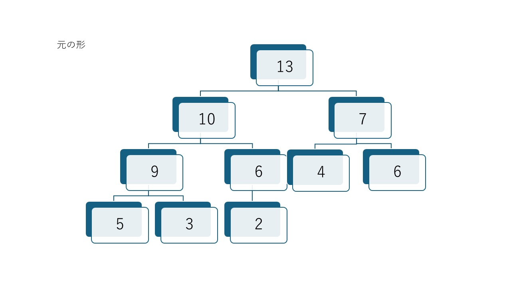
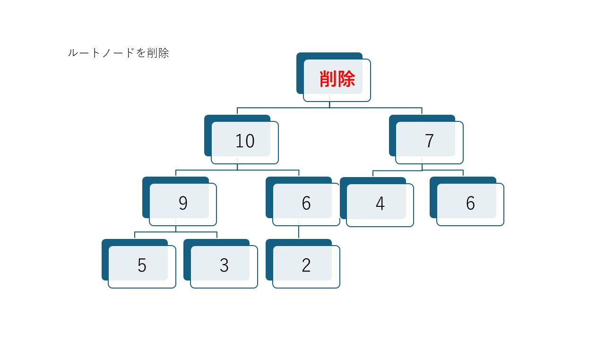
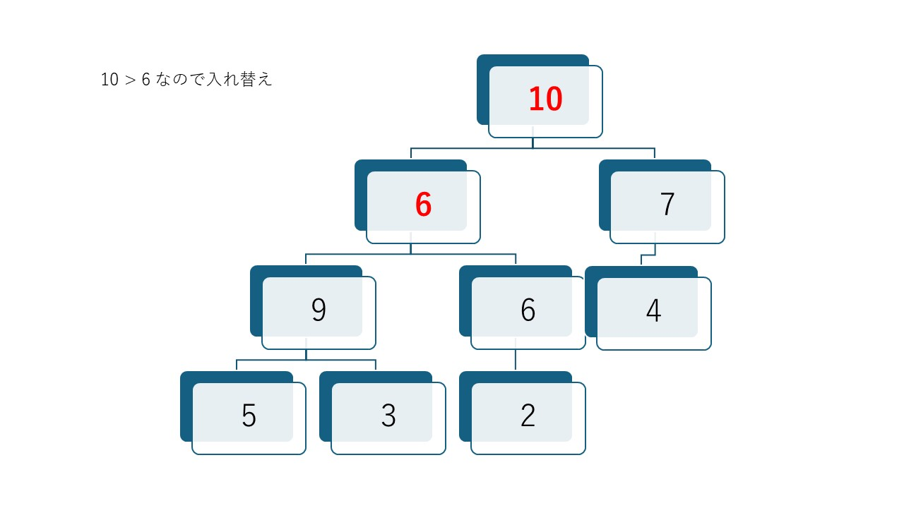
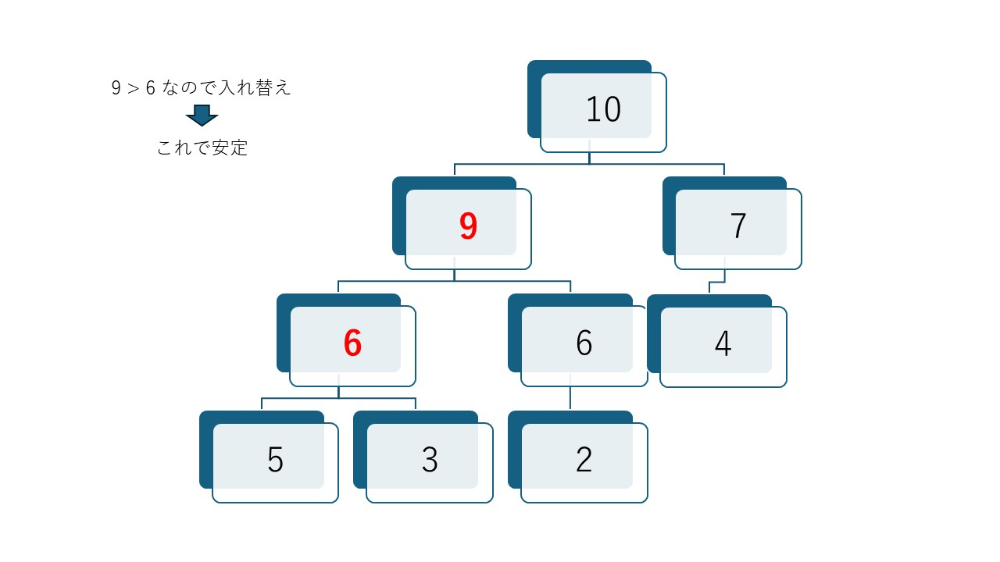

# ツリー構造

連結リストの「一列のつながり」をさらに発展させ、データが枝分かれして広がる様子を表現したのが **「ツリー構造（木構造）」** です。

コンピュータの世界では、ファイルシステムの管理やデータベースの高速検索など、いたるところでこの構造が使われています。

---

## I. アジェンダ

### 1. ツリー構造の基本イメージ

自然界の木とは逆で、コンピュータの世界では **「根（ルート）が一番上」** にあり、下に向かって枝分かれしていく「逆さまの木」として描かれるのが一般的です。

#### 主な用語

* **根（Root / ルート）：** 木の最上部にある唯一のノード。
* **節（Node / ノード）：** データが格納されている各点。
* **枝（Edge / エッジ）：** ノード同士を結ぶ線。
* **子・親：** 直接つながっている上下の関係。上が親、下が子。
* **葉（Leaf / リーフ）：** 子を持たない、末端のノード。

### 2. 二分木（Binary Tree）

ツリー構造の中で最も基本的かつ重要なのが **「二分木」** です。これは、どの親ノードからも **子が最大2つまで** しか出ないというルールの木です。

```text
            g                  s                  9
           / \                / \                / \
          b   m              f   u              5   13
         / \                    / \                /  \
        c   d                  t   y              11  15
```

さらに、以下の条件を加えた **「二分探索木」** は非常に強力です。

* **左の子**：親より小さい値
* **右の子**：親より大きい値

このルールのおかげで、データを探すときに「親より大きいか小さいか」を判断するだけで、探す範囲を一気に半分に絞り込めます（二分探索の原理です）。

### 3. ツリーの走査（なぞり方）

木にあるすべてのデータをチェックする方法（走査）には、いくつかのパターンがあります。基本情報技術者試験でもよく問われるポイントです。

1. **行きがけ順（前順）：** 親 → 左の子 → 右の子
2. **通りがけ順（間順）：** 左の子 → 親 → 右の子（二分探索木だと小さい順に並ぶ！）
3. **帰りがけ順（後順）：** 左の子 → 右の子 → 親

### 4. 身近なツリー構造の例

* **ファイルシステム：** Windowsの「フォルダ（ディレクトリ）」の構造そのものです（Cドライブがルート）。
* **組織図：** 社長をトップとしたピラミッド型の組織。
* **HTMLのDOM構造：** Webページの「`<body>`の中に`<div>`があって、その中に`<p>`がある」という階層。
* **家系図：** 先祖から子孫への広がり。

### 5. 特殊なツリー構造

* **完全二分木：** 葉以外のすべての節が2つの子を持ち、葉が左から順に詰まっているもの。以前解説した **「ヒープ」** もこの一種です。
* **平衡二分木（AVL木など）：** 左右の枝の長さのバランスが崩れないよう、自動で調整する賢い木。

```text
          平均木            平均木ではない
            g                  s        
           / \                / \       
          b   m              f   u      
         / \                    / \     
        c   d                  t   y    
                              /     \
                             x       r 
```

---

## II. 二分探索木

二分木の中でも、データの検索を効率化するために特定のルールを持たせたものが **「二分探索木（Binary Search Tree / BST）」** です。

単にデータを並べるだけでなく、「どこに何があるか」を予測しやすい形で配置するのが最大の特徴です。

### 1. 二分探索木の「鉄の掟」

二分探索木では、すべてのノードにおいて以下のルールが守られています。

* **左の子**のノード（およびその先にあるすべての値）は、**親よりも小さい**。
* **右の子**のノード（およびその先にあるすべての値）は、**親よりも大きい**。

```text
            7             9
           / \           / \
          3  13         5  13
         / \              /  \
        2   5            11  15
```

このルールが再帰的に適用されているため、どの部分を切り取っても「左 < 親 < 右」という関係が維持されます。

### 2. なぜ「探索」が速いのか？

例えば、この木の中から「5」という数字を探すとします。

1. **根（ルート）と比較：** ルートが「7」なら、5はそれより小さいので**右側は一切見る必要がありません**。一気に左の枝へ進みます。
2. **次の親と比較：** 次の親が「3」なら、5はそれより大きいので、次は右の枝へ進みます。

このように、1回比較するごとに**探す範囲がほぼ半分（またはそれ以下）に絞り込まれる**ため、非常に高速に目的のデータにたどり着けます。計算量は理想的な状態で  となります。

### 3. データの追加と削除

#### 追加（挿入）

新しいデータを追加するときもルールに従います。ルートから順に「自分より大きいか小さいか」を判断しながら空いている場所（葉）を探し、そこに新しいノードをくっつけます。

#### 削除

削除は少し工夫が必要です。

* **子がいない場合：** そのまま削除して終わり。
* **子が1つの場合：** 親と孫を直接つなぎ直します。
* **子が2つの場合：** 削除するノードの代わりに、「左側の山で一番大きい値」または「右側の山で一番小さい値」を持ってきて、全体のルールが崩れないようにします。

### 4. 二分探索木の「弱点」と克服

二分探索木には一つ大きな弱点があります。それは、データが「1, 2, 3, 4, 5...」のように順番に入力された場合、枝が片側にだけ伸びて、ただの **「連結リスト」のような一本道** になってしまうことです。

これを防ぐために、自動で枝の長さを調整してバランスを保つ **「平衡二分探索木（AVL木や赤黒木など）」** という高度な仕組みも存在します。

### 5. 疑似言語での探索イメージ

基本情報技術者試験の疑似言語風に書くと、探索処理は以下のようになります。

二分探索木のノードを表すクラスの定義

* クラス名: Node
* メンバ変数:
    * 整数型: val
    * Node: left
    * Node: right

```text
/* 探索を行う関数 */
○ 文字列型: search(Node: node, 整数型: target)
    if (node ＝ null)
        return "見つかりませんでした"
    elseif (node．val ＝ target)
        return "見つかりました！"
    elseif (node．val ＞ target)
        return search(node．left, target)  /* 左へ進む（再帰） */
    else
        return search(node．right, target) /* 右へ進む（再帰） */
    endif
```

---

## III. ヒープ

ソートアルゴリズムの回でも少し触れましたが、**「ヒープ (Heap)」** は二分木をベースにした非常に効率的なデータ構造です。

「ヒープ（積み上げた山）」という名前の通り、**「一番大きい（または小さい）要素を常にすぐ取り出せるようにしておく」** という目的に特化しています。

### 1. ヒープの2つの絶対条件

ヒープとして成立するためには、以下の2つのルールを同時に満たす必要があります。

1. 親子関係のルール：親ノードの値は、子ノードの値よりも必ず大きい（または等しい）。左右の子どものどちらが大きいかにはルールはありません。
1. 形のルール（完全二分木）：上から順番に隙間なくノードが詰まっていて、最下位の段は必ず左詰めでデータが入れられます。

```text
            7            15
           / \           / \
          5  13         5  13
         / \              /  \
        3   2            11   9
```

このルールによって作られたものを、「最大ヒープ」といいます。逆に「親の値 < 子の値」の最小ヒープと呼ばれるヒープもありますが、基本情報処理技術者試験などでは、あまり取り上げられません。

### 2. なぜヒープを使うのか？（メリット）

「データの山から一番大きな値を見つける」だけなら、最大ヒープの頂点を見るだけ（計算量 ）で済みます。

さらに重要なのは、以下の2点です。

* **高速な再構築：** データの追加や削除を行っても、高速に「山」を整え直せる。
* **配列との相性：** 完全二分木なので、ポインタを使わなくても「普通の配列」で親子関係を計算（親が  なら子は ）できるため、メモリ効率が非常に良いです。

### 3. ヒープの再構築：ヒープ化 (Heapify)

データを削除（頂点を取り出した）したとき、ヒープは以下の手順で形を整えます。




1. **空いた頂点に、一番末尾（右下）の要素を持ってくる。**


2. **その要素を子と比較し、ルール違反（子が自分より大きい等）なら入れ替える。**



3. **これを適切な位置に収まるまで繰り返す（沈み込み）。**



### 4. 実社会・ITでの活用例

* **優先度付きキュー (Priority Queue)：**
単なる待ち行列（キュー）ではなく、「緊急度の高い人から順に処理する」という仕組みに最適です。
* **ヒープソート：**
ヒープの頂点（最大値）を順に取り出し続けることで整列させるソート法です。
* **OSのタスクスケジューリング：**
CPUが実行すべきタスクの中から、優先順位が最も高いものを瞬時に見つけ出すために使われます。

### 5. 基本情報技術者試験での重要度

試験では、**「配列で表現されたヒープ」** を読み解く問題がよく出ます。
「インデックス0番がルート、1番と2番がその子、3番と4番は1番の子…」といった配列の並びと、ツリー構造を頭の中で一致させられるかが鍵になります。

---

## IV. 深さ優先探索

ツリー構造（木構造）のすべてのノードを、ある一定の規則に従って1回ずつ訪問することを **「木の巡回（Tree Traversal）」** と呼びます。

特に「二分木」における巡回法は、基本情報技術者試験でも計算問題やアルゴリズム問題として非常によく出題される重要なトピックです。


### 1. 巡回の2つの大きなアプローチ

巡回には、大きく分けて「深さ」を優先するか「広さ」を優先するかという2つの考え方があります。

* **深さ優先探索 (DFS: Depth-First Search):**
行けるところまで深く進み、行き止まったら戻って別の枝を探す方法。
* **幅優先探索 (BFS: Breadth-First Search):**
根に近い階層から順番に、横方向に1段ずつ制覇していく方法。


### 2. 二分木の「深さ優先巡回」3パターン

試験で最も重要なのが、この3つのパターンです。「親ノードをどのタイミングで訪問するか」によって名前が決まっています。

#### ① 行きがけ順 (Pre-order / 先順)

**「親 → 左の子 → 右の子」** の順で訪問します。


* **動き:** ノードにたどり着いた瞬間にその値を処理します。
* **用途:** 木のコピーを作成する場合や、数式の「ポーランド記法」への変換に使われます。

#### ② 通りがけ順 (In-order / 間順)

**「左の子 → 親 → 右の子」** の順で訪問します。


* **動き:** 左の枝をすべて処理し終えてから、親を処理し、最後に右へ行きます。
* **重要ポイント:** **「二分探索木」をこの順で巡回すると、データが小さい順（昇順）に取り出せます！**

#### ③ 帰りがけ順 (Post-order / 後順)

**「左の子 → 右の子 → 親」** の順で訪問します。


* **動き:** 子どもたちをすべて処理し終えてから、最後に親を処理します。
* **用途:** ディレクトリの容量計算（子フォルダの合計を親に足す）や、数式の「逆ポーランド記法」への変換に使われます。

### 3. 数式の表現と巡回（具体例）

数式 `(A + B) * C` を木構造（演算木）で表現すると、巡回方法によって書き方が変わります。

* **通りがけ順:** `A + B * C` （通常の書き方に近い）
* **行きがけ順:** `* + A B C` （ポーランド記法）
* **帰りがけ順:** `A B + C *` （逆ポーランド記法：スタック計算で使われる形式）

### 4. 覚え方のコツ：自分をいつ呼ぶか？

再帰関数で考えると、コードの「どこで」値を表示するかだけの違いです。

```c
void traverse(Node *node) {
    if (node == NULL) return;

    // ここで処理すると「行きがけ」
    traverse(node->left);
    // ここで処理すると「通りがけ」
    traverse(node->right);
    // ここで処理すると「帰りがけ」
}
```

---

## V. 幅優先探索

「木の巡回」のアプローチの一つである **幅優先探索（BFS: Breadth-First Search）** は、出発点から近い順に、階層（レベル）ごとにしらみつぶしに調べていく手法です。


深さ優先探索（DFS）が「行けるところまで突き進む」のに対し、幅優先探索は **「周囲をまんべんなく広げながら進む」** のが特徴です。

### 1. 幅優先探索のイメージ：波紋の広がり

水面に石を投げたときに広がる「波紋」をイメージしてください。中心から近いところから順番に波が伝わっていく様子が、まさに幅優先探索の動きです。

* **レベル0:** 根（スタート地点）を調べる。
* **レベル1:** 根に直接つながっているノードをすべて調べる。
* **レベル2:** レベル1のノードからつながっているノードをすべて調べる。
* （以下、目的のものが見つかるまで続く）

### 2. 仕組みの鍵は「キュー（Queue）」

幅優先探索を実現するためには、以前解説したデータ構造 **「キュー（FIFO: 先入れ先出し）」** を使います。

#### 探索の手順（アルゴリズム）

1. 開始ノードを**キュー**に入れる。
2. キューが空になるまで以下を繰り返す：
    * キューの先頭からノードを取り出す（これが現在地点）。
    * そのノードの「まだ訪問していない隣人（子）」をすべて**キューの後ろに追加**する。

先にキューに入れたもの（近いもの）から順に取り出されるため、自然と「近い順」の探索になります。

### 3. 幅優先探索のメリット・デメリット

| 特徴 | 内容 |
| --- | --- |
| **最短経路が見つかる** | すべての経路を短い順に調べていくため、最初に見つかったゴールが必ず「最短（最小ステップ）」になります。 |
| **メモリ消費量** | 階層が深くなるほど、キューに溜まるノード数が爆発的に増える可能性があるため、DFSよりメモリを多く消費しがちです。 |
| **無限ループに強い** | （グラフ探索の場合）たとえ無限に続く枝があっても、横に広がりながら探すため、いつかはゴールに到達できます。 |

### 4. 実社会での活用例

* **最短ルート検索:** カーナビや路線検索アプリ。
* **SNSの「知り合いかも」:** 自分から1親等、2親等の順に辿って、つながりの近い人を探す。
* **Webクローラ:** サイトのトップページからリンクを辿って、階層の浅いページから順にインデックスを作成する。

### 5. 深さ優先（DFS）との違い（まとめ）

* **DFS（スタック使用）：** 迷路を「壁に手をついて進む」ように、奥へ奥へと進む。行き止まりまで行かないと戻らない。
* **BFS（キュー使用）：** 「ライトを広角に照らす」ように、手前から均等に探していく。

---

