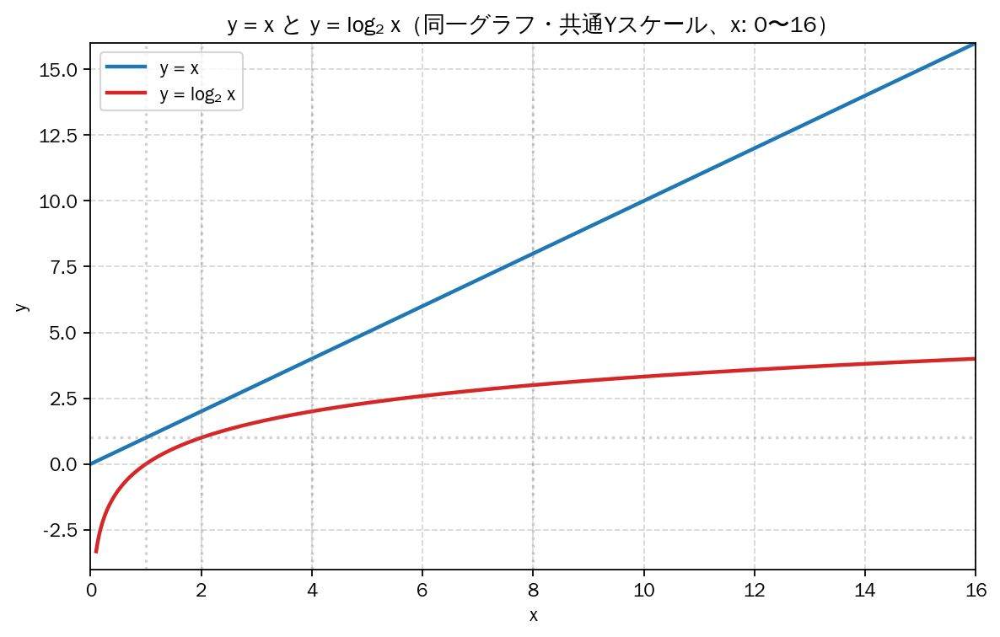

# 計算量と探索

## アルゴリズムの性能分析

2つのアルゴリズムの優劣を判断するために、その性能を客観的に評価する指標が必要となります。

### 1. 漸近的解析 (Asymptotic Analysis)

アルゴリズムの性能を評価する単純な方法として、プログラムを実装し実行時間を計測する方法があります。しかし、このアプローチには以下のような問題点があります。

* 入力依存性: 特定の入力ではアルゴリズムAが速くても、別の入力ではアルゴリズムBが速い場合がある。
* 環境依存性: 同じプログラムでも、実行するマシンの性能によって実行時間が大きく異なる。

これらの問題を解決するのが漸近的解析です。この手法では、実際の実行時間を計測する代わりに、アルゴリズムの性能を **入力サイズ (n)の関数として評価する。特に、入力サイズが非常に大きくなった際の処理時間（または使用メモリ）の成長の度合い（order of growth）** を計算します。これにより、マシン性能のような定数倍の差を無視し、アルゴリズムの本質的な効率を比較できます。

### 2. 計算量とO記法

アルゴリズムの性能評価には計算量という指標が用いられます。計算量には、処理時間を評価する時間計算量と、必要な記憶容量を評価する空間計算量がありますが、一般的には前者を指します。

計算量の記述には **O記法（オーダー記法）** が広く用いられます。これは、入力サイズ n に対する処理ステップ数の増加率の上限（最悪ケース）を示すもので、アルゴリズムの効率を分類するための基準となります。

|O記法|名称|説明|代表的なアルゴリズム|
|---|---|---|---|
|$O(1)$|定数時間|データ数に関わらず、処理時間が一定。|配列のインデックスアクセス|
|$O(log_n$)|対数時間|データ数が倍増しても、ステップ数はわずかにしか増加しない。|二分探索|
|$O(n$)|線形時間|データ数に比例して処理時間が増加する。|線形探索|
|$O(nlog_n$)|線形対数時間|データを分割し、各要素を処理する効率的なソート。|マージソート、クイックソート|
|$O(n^2$)|二乗時間|データ数が増えると、処理時間が急激に増加する（二重ループなど）。|バブルソート、選択ソート|
|$O(2^n$)|指数時間|データ数が少し増えるだけで処理時間が爆発的に増加する。|集合分割問題|

コンピュータ科学では、最悪ケース（アッパーバウンド）を示すO記法の他に、最良ケース（ロワーバウンド）を示すΩ（オメガ）記法、そして最良と最悪が一致する場合を示すΘ（シータ）記法も用いられます。

### 3. 分析の限界

漸近的解析は強力なツールだが、万能ではありません。

* 定数係数の無視: O記法では $1000nlog_n$ も $2nlog_n$ も同じ $O(nlog_n)$ と評価される。しかし、実際のパフォーマンスには大きな差が出る可能性がある。
* 入力サイズの前提: 漸近的解析は入力サイズが十分に大きいことを前提とする。特定の小規模な入力に対しては、理論上遅いアルゴリズムの方が速く動作することもあり得る。例えば、理論上はヒープソートがクイックソートより優れているが、実践ではクイックソートの方が速いことが多い。

## 線形探索法と二分探索法

同じ問題に対して、異なるアルゴリズムがいかにして大きく異なる効率性を持つかを知るために、ちょっとしたゲームをしてみましょう。『数当てゲーム（High & Low）』と呼ばれるゲームです。

1. コンピューター(🖥️)は1から100までの整数をランダムに選択します。
2. あなた(👨‍🎓)はコンピューター(🖥️)が選んだ数字を見つけるまで数字を推測し続けます。
3. コンピューター(🖥️)は、あなた(👨‍🎓)の推測が、「小さすぎる」か、「大きすぎる」か、または「正解」か、を毎回教えてくれます。

#### 線形探索法（リニアサーチ）

もし、1から順に、`1、2、3、4 ...`  といった具合に推測を始めると、次のようになります。

```
👨‍🎓: あなたが思い浮かべた数字は 1 ですか？
🖥️: 小さすぎます
👨‍🎓: 2 は？
🖥️: 小さすぎます
👨‍🎓: 3 は？
🖥️: 小さすぎます
👨‍🎓: 4 は？
🖥️: 小さすぎます
(以下略)
```

このアプローチは **線形探索** と呼ばれます。すべての数字が一列に並んでいるかのように推測するからです。もちろん、この方法も有効です。必ず正解にたどり着きます。非常に幸運な場合、コンピューターが1を選択し、最初の推測でその数字が当たることもあります。

しかし、最悪の場合、何回推測する必要があるでしょうか？ コンピューターが100を選択した場合、100回の推測が必要になります。

#### 二分探索法（バイナリサーチ）

もっとよい方法があります。まずは50を推測してみましょう。

```
👨‍🎓: 50 は？
🖥️: 小さすぎます
```

50 は小さすぎました。しかし、この時点で1 から50 までの数字はすべて小さすぎることがわかります。

逆に、もし、「大きすぎます」と言われたら、1から49までを除外できます。

どちらの場合でも、半分の数字を推測の対象外にできます。

さて、50は小さすぎるので、次に、50と100の中間の、75 と推測します。

```
👨‍🎓: 75 は？
🖥️: 大きすぎます
```

75 は大きすぎました。が、この場合も、残りの数字の半分が除外されます。つまり75～100はもはや推測の対象になりません。

次に、（50 と75 の中間である）63 と推測します。

```
👨‍🎓: 63 は？
🖥️: 大きすぎます
```

このように、毎回「中央の数字を推測し、残りの数字の半分を除外する」を繰り返します。そうすれば、最後に正解に行き着くでしょう。

```
👨‍🎓: 57 は？
🖥️: 正解！
```

この半分にするアプローチを **二分探索** と呼び、コンピューターが 1 から 100 までのどの数字を選択したかに関係なく、この手法を使用すると最大 7 回の推測でその数字を見つけることができます。

|探索回数|残りの数字|
|---|--:|
|0|100|
|1|50|
|2|25|
|3|13|
|4|7|
|5|4|
|6|2|
|7|1|

---

今度は、ある単語を辞書で探しているとしましょう。その辞書には、240000 語が収録されています。最悪のケースでは、線形探索と二分探索に必要なステップ数はどれくらいになるでしょうか。

線形探索では、探している単語が辞書の最後の最後にある場合は、**240000 ステップ**が必要になります。

二分探索では、単語が1 つだけになるまで、ステップごとに残りの単語の個数を半分にしていきます。

|探索回数|残りの単語|
|---|--:|
|0|240000|
|1|120000|
|2|60000|
|3|30000|
|4|15000|
|5|7500|
|6|3250|
|7|1875|
|8|938|
|9|469|
|10|235|
|11|118|
|12|59|
|13|30|
|14|15|
|15|8|
|16|4|
|17|2|
|18|1|

したがって、二分探索に必要なステップ数は、**18ステップ** になります。これは大きな差です。

## アルゴリズムの計算量

一般的に、$n$ 個の要素からなるリストでは、最悪の場合、

* 線形探索法では、$n$ ステップが必要になります
* 二分探索法では$log_2 n$ ステップが必要になります

---

**対数**

さきほどから『$log_2 n$』という表記が出てきて戸惑ったでしょうか？ これは **対数** （たいすう）です。

対数が何であるかは忘れてしまったかもしれませんが、**指数** （しすう）なら覚えている人もいるのではないでしょうか。

指数とは、一言でいうと **「同じ数字を何回掛け算するかけるか」を表す省略記法** のことです。例えば、「2 を3 回かける」という計算を普通に書くとこうなります。

$2 \times 2 \times 2 = 8$

これを指数を使って書くと、右上に小さく数字を乗せて、次のようにスッキリ表現できます。

$2^3 = 8$

これが指数です。そして、**対数は指数をひっくり返したもの** です。

$log_{10} 100$ は、「10 を何回掛けると100 になるか」と質問するようなものです。$10^2$(つまり $10 \times 10 = 100$ですから，その質問の答えは、$2$) です。よって、$log_{10} 100 = 2$ となります。

|指数|それをひっくり返した対数|
|--:|--:|
|$10^2 = 100$|$log_{10} {100} = 2$|
|$10^3 = 1000$|$log_{10} {1000} = 3$|
|$2^3 = 8$|$log_2 8 = 3$|
|$2^4 = 16$|$log_2 {16} = 4$|
|$2^5 = 32$|$log_2 {32} = 5$|

***

さてさて、対数の説明が終わったところで、あらためて前掲の **『最悪の場合、二分探索では$log_2 n$ ステップが必要になります』** という文について、確認してみましょう。

要素が8 個のリストでは、$2^3 = 8$ であるため、$\log_2 8 = 3$ となります。したがって、要素が8 個のリストでは、最大で3 個の数字を調べることになります。

また要素が1024 個のリストでは、$2^{10} = 1024$ であるため、$\log_2 1024 = 10$ となります。したがって、要素が1,024 個のリストでは、最大で10個の数字を調べることになります。

このように、その **アルゴリズムの実行にどれだけの時間が掛かるかを示す指標** を『**時間計算量**』と呼びます。

### 時間計算量

時間計算量について、もう少し考えてみます。

二分探索を使って節約される時間はどれくらいになるのでしょうか。

線形探索では、数字を1 つ1 つチェックしました。これが100 個の数字からなるリストであるとすれば、最大で100 回の推測が必要になります。数字が40億個の場合は、最大で40 億回の推測が必要になります。したがって、推測の最大数はリストのサイズとなります。これを **線形時間（linear time）** と呼びます。

二分探索は、そのようにはなりません。要素が100 個のリストでは、最大で7 回の推測が必要です。要素が40 億個の場合は、最大で32 回の推測が必要です。二分探索の計算時間は **対数時間（logarithmic time）** になります。

二つの時間の差は、要素の数が増えれば増えるほど、大きくなります。



要素が16個でこの差ですから、数が大きくなれば、グラフに載せられないほどのものになります。

つまり、アルゴリズムの計算時間を知るだけでは不十分で、リストのサイズが増えるに従って **計算時間がどのように変化するか** を知っておく必要があります。そこで登場するのが、**オーダー記法** です。

|線形探索|二分探索|
|:---:|:---:|
|100個の要素→100回の推測|100個の要素→7回の推測|
|4000000000個の要素→4000000000回の推測|4000000000個の要素→32回の推測|
|$O(n$)|$O(log_2 n)$|

上の表の最後の行で示したのが、**オーダー記法** です。これは、アルゴリズムがどれくらい高速であるかを表す特別な表記法です。

*※ 『オーダー記法』は『オー記法』あるいは『ビッグーオー記法』と呼ぶこともあります*

### オーダー記法

ここでは、オーダー記法がどのようなものであるかを説明した後、オーダー記法を使ってさまざまなアルゴリズムの最も一般的な計算時間を示すことにします。

オーダー記法は、**アルゴリズムがどれくらい高速に拡大するのか** を明らかにします。たとえば、大きさが $n$ のリストがあるとしましょう。線形探索では、要素を1 つ1 つ調べる必要があるため、演算を $n$ 回実行することになります。オーダー記法で表された計算時間は **$O(n)$** です。オーダーは、速度を秒で表しません。オーダー記法は、演算の個数を比較できるようにするのです。

別の例を見てみましょう。二分探索で大きさがn のリストを調べるには、$log_n$ 回の演算が必要です。オーダー記法で計算時間を表すとどうなるでしょうか。**$O(log_n)$** になります。

一般に、オーダー記法は次のように記述されます。

$O(n)$

nは演算の回数です。

　これはアルゴリズムの演算の実行回数を表しています。

#### オーダーは最悪の場合の時間計算量を定める

線形探索を使って電話帳で人を探しているとしましょう。線形探索の計算時間はO(n) であることがわかっています。つまり、最悪の場合は、電話帳のエントリを1 つ残らず調べる必要があります。

しかし、ここで探している人の名前は「Abe」です。Abe は電話帳の先頭に載っているため、他のエントリを調べる必要はまったくありませんでした。つまり、最初の試みで見つかったわけです。

このアルゴリズムの計算時間は$O(n)$ でしょうか。それとも、最初の試みで見つかったので$O(1)$ でしょうか。

線形探索の計算時間が$O(n)$ であることは変わりません。この場合は、探しているものがすぐに見つかりました。それは最良のシナリオです。しかし、オーダー記法は最悪のシナリオに関するものです。

「最悪の場合は電話帳のエントリをひととおり調べる必要がある」と表現で
きるのはそのためです。それが$O(n)$ 時間であり、線形探索に$O(n)$ よりも時間がかからないという保証のようなものです。

>最悪のケースの計算時間に加えて、平均的な計算時間を調べることも重要です。これについては、別の機会に説明します。


#### オーダー記法の一般的な時間計算量

　今後、あなたがよく目にすることになる5 つのオーダー計算時間を最も高速なものから順に並べてみましょう。

|オーダー記法|例|備考|
|---|---|---|
|$O(log_n)$|二分探索|対数時間とも呼ばれる|
|$O(n)$|線形探索|線形時間とも呼ばれる|
|$O(nlog_n)$|クイックソート|高速なソートアルゴリズム|
|$O(n^2)$|選択ソート|低速なソートアルゴリズム|
|$O(n!)$|巡回セールスマン|非常に低速なアルゴリズム|

　計算時間は他にもありますが、最も一般的なのは、この5 つです。

　これは単純化した図です。実際には、オーダー記法による計算時間をここまできれいに変換できるわけではありませんが、今のところはこれで十分でしょう。ひとまず、主な点をまとめておきます。

* アルゴリズムの速度は秒数ではなく演算の実行回数の増加によって表される。
* 入力のサイズが増えるに従ってアルゴリズムの計算時間がどれだけのペースで上昇するのかが表される。
* アルゴリズムの計算時間はオーダー記法で表される。
* O(log n)はO(n)よりも高速だが、検索の対象となる要素のリストが大きくなるに従って加速する。

