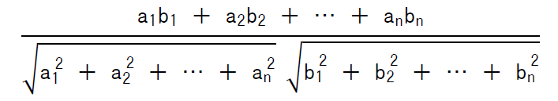

# 第4章　試験問題に慣れていこう

## トレース問題

与えられたデータを使って、実行結果を求める。

与えられたデータを使ってアルゴリズムを実行したとき、途中のある時点や処理の終了時に、変数や戻り値、配列要素がどのような内容になっているか問われる。

例:

---
次のプログラムを実行したとき、変数 `total` の値はどうなるか。

**〔プログラム〕**
* 整数型の二次元配列: `grid ← {{1, 2}, {3, 4}}` // 2行2列
* 整数型: `r, c, total ← 0`
* for (`r` を 1 から 2 まで 1 ずつ増やす)
    * for (`c` を 1 から 2 まで 1 ずつ増やす)
        * `total ← total ＋ grid[r, c]`
    * endfor
* endfor

**【解答群】**
ア　3
イ　6
ウ　10
エ　15

---

## 空欄穴埋め問題

空欄は、選択処理の条件式や繰り返し処理の条件式・制御記述などになることが多い。

例:

---

次のプログラムは、引数 `score`（点数）に応じて成績を返す関数である。95点の場合に正しく "S" を返すために、空欄に入る条件式の組み合わせとして正しいものを選べ。

**〔プログラム〕**
* 〇文字列型: `checkGrade`(整数型: `score`)
    * if ( **【 a 】** )
        * return "S"
    * elseif ( **【 b 】** )
        * return "A"
    * else
        * return "B"
    * endif

**【解答群】**
ア　a: `score ≧ 60`, b: `score ≧ 90`
イ　a: `score ≧ 90`, b: `score ≧ 60`
ウ　a: `score ＞ 60`, b: `score ＞ 95`
エ　a: `score ＝ 90`, b: `score ＝ 60`

---

## チェックポイント問題

繰り返し処理において、特定の時点で、処理を何回実行したか、を問われる問題。回数だけでなく、変数の値や配列の値を問われることもある。データが問題で与えられず、自分で仮のデータを考える必要がある場合もある。

例:

---

関数 `search` を `search("AAAAA", "AA")` として呼び出したとき、条件式「`data[i+j-1] が key[j] と等しい`」が真となる回数は何回か。

**〔プログラム〕**
* 〇整数型: `search`(文字型の配列: `data`, 文字型の配列: `key`)
    * for (`i` を 1 から `(dataの要素数 － keyの要素数 ＋ 1)` まで 1 ずつ増やす)
        * for (`j` を 1 から `keyの要素数` まで 1 ずつ増やす)
            * if (`data[i ＋ j － 1]` が `key[j]` と等しい)
                // 一致判定
            endif
        endfor
    endfor

**【解答群】**
ア　4回
イ　5回
ウ　8回
エ　10回
---

## 計算式を考える問題

数学的な方法を必要とする

問５ 次のプログラム中の と に入れる正しい答えの組合せを，
解答群の中から選べ。ここで，配列の要素番号は1 から始まる。
コサイン類似度は，二つのベクトルの向きの類似性を測る尺度である。関数
calcCosineSimilarity は，いずれも要素数がn(n≧1) である実数型の配列vector1
とvector2 を受け取り，二つの配列のコサイン類似度を返す。配列vector1 が {a1,
a2, …, an}，配列vector2 が {b1, b2, …, bn} のとき，コサイン類似度は次の数式で
計算される。ここで，配列vector1 と配列vector2 のいずれも，全ての要素に0 が格
納されていることはないものとする。



```text
〔プログラム〕
○実数型: calcCosineSimilarity(実数型の配列: vector1, 実数型の配列: vector2)
実数型: similarity, numerator, denominator, temp ← 0
整数型: i

numerator ← 0
for (i を 1 から vector1の要素数 まで 1 ずつ増やす)
    numerator ← numerator ＋
endfor

for (i を 1 から vector1の要素数 まで 1 ずつ増やす)
    temp ← temp ＋ vector1[i]の2乗
endfor
denominator ← tempの正の平方根

temp ← 0
for (i を 1 から vector2の要素数 まで 1 ずつ増やす)
    temp ← temp ＋ vector2[i]の2乗
endfor
denominator ← 【b】

similarity ← numerator ÷ denominator
return similarity
```

解答群
a b
ア
(vector1[i] × vector2[i])の正の
平方根
denominator × (tempの正の平方根)
イ
(vector1[i] × vector2[i])の正の
平方根
denominator ＋ (tempの正の平方根)
ウ
(vector1[i] × vector2[i])の正の
平方根
tempの正の平方根
エ vector1[i] × vector2[i] denominator × (tempの正の平方根)
オ vector1[i] × vector2[i] denominator ＋ (tempの正の平方根)
カ vector1[i] × vector2[i] tempの正の平方根
キ vector1[i]の2乗 denominator × (tempの正の平方根)
ク vector1[i]の2乗 denominator ＋ (tempの正の平方根)
ケ vector1[i]の2乗 tempの正の平方根